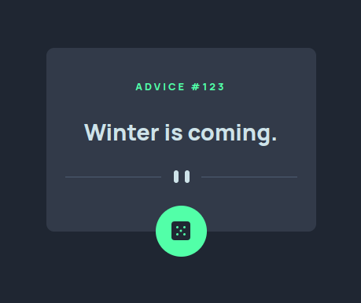

# Frontend Mentor - Expenses chart component solution

This is a solution to the [Expenses chart component challenge on Frontend Mentor](https://www.frontendmentor.io/challenges/expenses-chart-component-e7yJBUdjwt). Frontend Mentor challenges help you improve your coding skills by building realistic projects.

## Table of contents

- [Overview](#overview)
  - [The challenge](#the-challenge)
  - [Screenshot](#screenshot)
  - [Links](#links)
- [My process](#my-process)
  - [Built with](#built-with)
  - [What I learned](#what-i-learned)
  - [Continued development](#continued-development)
  - [Useful resources](#useful-resources)
- [Author](#author)
- [Acknowledgments](#acknowledgments)

## Overview

### The challenge

Users should be able to:

- View the bar chart and hover over the individual bars to see the correct amounts for each day
- See the current day’s bar highlighted in a different colour to the other bars
- View the optimal layout for the content depending on their device’s screen size
- See hover states for all interactive elements on the page
- **Bonus**: Use the JSON data file provided to dynamically size the bars on the chart

### Screenshot



### Links

- Live Site URL: [Expenses chart component - waikoo](https://expenses-chart-component-olive.vercel.app/)

## My process

### Built with

- Semantic HTML5 markup
- CSS custom properties
- Flexbox
- Mobile-first workflow
- Chart.js

### What I learned

#### Chart.js

I learned to use an external library - Chart.js - for the very first time in this challenge. I found out that the minified version of the CDN results in lower bandwidth. Some resources advise to use the `head`, while others to use it in the `body`. I tested both and decided to go with it being in the body right before the script for my main `*.js` file for clarity, for this project.

Customizing the default chart required heavy diving into the documentation, Googleing & (my own) Stack Overflowing (literally).

The provided JSON file being the source for the chart's values, following the journey of these values all the way to displaying those in the chart I came to a better understanding of how JavaScript closures work. This is also due to the fact that I'm trying to organize my logic into functions as much as I can, at least more than before, in order to get a more modular code and to make debugging easier.

This project reinforced what I already knew, and filled in gaps about things I didn't know about objects, methods, return values, callbacks, closures due to the config object's structure you use to instantiate a new chart with Chart.js.

#### Nightmares about returning values from an async function

There was an earlier project I worked on where I was trying to use fetch in a function with a premature understanding of closures, and I didn't know that the data it got from the API had to be returned by the function in order for me to use it in my code.

This can be solved with:

##### Method #1

```js
async function fetchData() {
	const url = './data.json';
	const response = await fetch(url);
	const data = await response.json();
	return data;
}
```

But simply storing the return value of `fetchData()` in a variable gives an error. It's because in my case, the wrapper function, `updateChart()` had to be an async function too in order for this syntax to work:

```js
const data = await fetchData();
```

##### Method #2

The other way of using returned data from an async function that I found is by using `.then()` and its callback, in which case the wrapper `updateChart()` function doesn't need to be async:

```js
fetchData().then(data => {
	// work with - or display data
});
```

So if I understand correctly, **I can only await the return of an async function within the scope of another async function.**

#### Making elements accessible where the content is otherwise unknown

I also found something cool through the documentation that I haven't seen implemented with an example that got the point across:

```html
<div class="chart-canvas-con">
	<canvas aria-label="bar chart" role="img" id="chart"></canvas>
</div>
```

#### Workflow milestone

I realized it's way faster to:

- Identify, Ctrl + Shift + C, click an element you want to change the CSS of
- In DevTools you modify your rules by clicking on them, and use Alt + Up Arrow for decimal increase/decrease of value, Up Arrow only for whole unit changes
- Or with FlexBox for example, you write `justify-content:` and the options immediately pop up for you to go through them with the arrow keys while the elements **change on the page** as you go over the selected values, so you see your changes live
- Copy it over to VSCode
- Repeat

Than it is to change everything locally and think about how many increments should I go up or down in VSCode while still having to Ctrl + S to see any changes.

### Continued development

In the future I would like to focus on not writing all the logic in the global scope but to have functions everywhere.

Where it makes sense I would like to write out helper functions to separate modules and import them as defaults into the main `app.js` file.

```js
const statement =
	'This being my first `README.md` edit ever, I liked writing it so much that I might even go back to my previously uploaded FrontendMentor challenges to write a customized README for all of them.';

function lieDetector(statement) {
	if (statement === true) {
		return 'All my previous FrontendMentor challenges have got customized README.mds.';
	} else {
		return 'I got carried away.';
	}
}

const result = lieDetector(statement);
```

### Useful resources

- [Chart.js YouTube Channel](https://www.youtube.com/c/ChartJS-tutorials) - This channel is a goldmine for anyone wanting to learn Chart.js. The documentation is great, but from an implementation POV, I couldn't have completed this project without his videos.

- [StackOverflow - How to return value from async function](https://stackoverflow.com/questions/49938266/how-to-return-values-from-async-functions-using-async-await-from-function) - This helped me understand the other way of using the return value of an async function. I was getting the same `Promise { <pending> }` response in my console as well when the wrapper function wasn't async too.

- [Chart.js Documentation - Accessibility](https://www.chartjs.org/docs/latest/general/accessibility.html) - This page in the Chart.js documentation helped me understand how could I make a `canvas` element accessible.

## Author

- Frontend Mentor - [@waikoo](https://www.frontendmentor.io/profile/waikoo)

## Acknowledgments

My wife.
